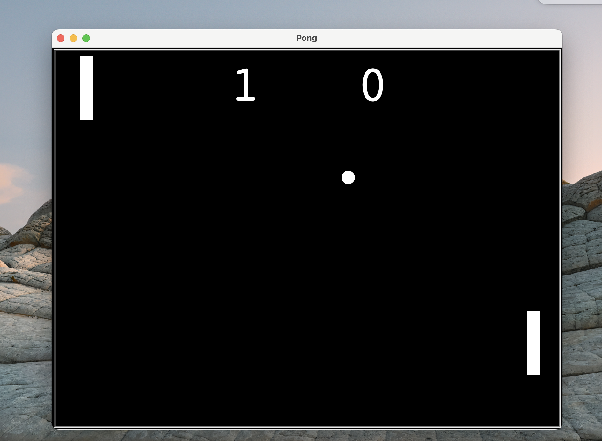

# pong-game
Simple 2 player Famous Arcade game - PONG using python turtle library

## Overview

Play 2 player PONG using this Python App. Commands to use:
- Player 1:
    - W = up
    - S = down

- Player 2:
    - up-arrow key = up
    - down-arrow key = down




## To download

```
git clone https://github.com/menonrudhra/pong-game.git
cd pong-game
```

## To run the App 

```
python3 main.py
```